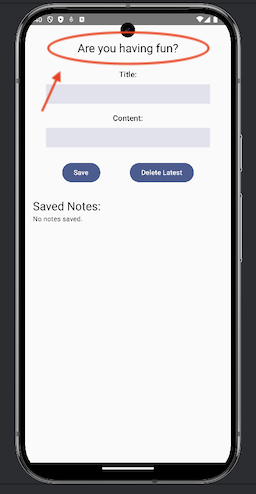

# Add API Integration Functionality to an Android App
A simple Android app that fetches text from API and displays it with UI using Jetpack Compose.


## 📱 App Screenshot  



## Usage  
Clone this repository and open the project in **Android Studio**.

```sh
git clone https://github.com/takehika0129/no13-android-app-with-external-api
```

Run the app on an Android device (minSdk 30) or an emulator.


## Concept
[Visit (takehika0129.github.io)](https://takehika0129.github.io/takehika-github-pages/reviews/prototype13.html)


## License
You are free to use this code for personal and educational purposes. Commercial use and redistribution are not allowed.